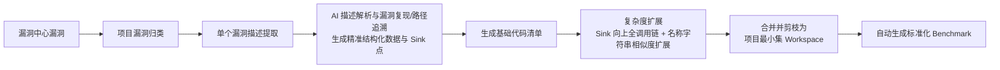
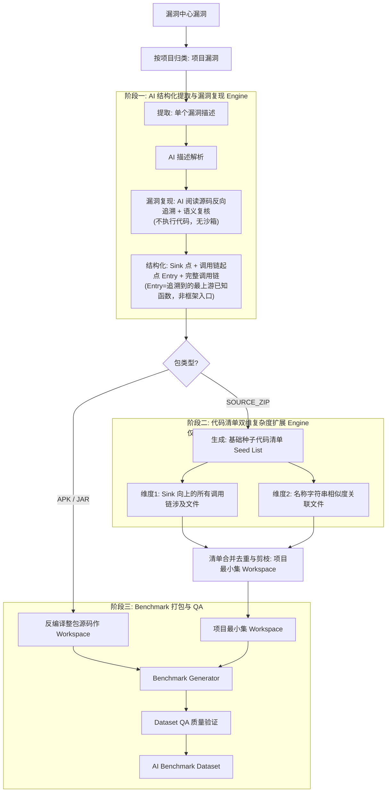
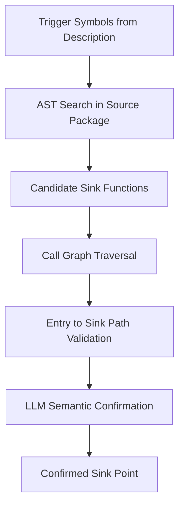
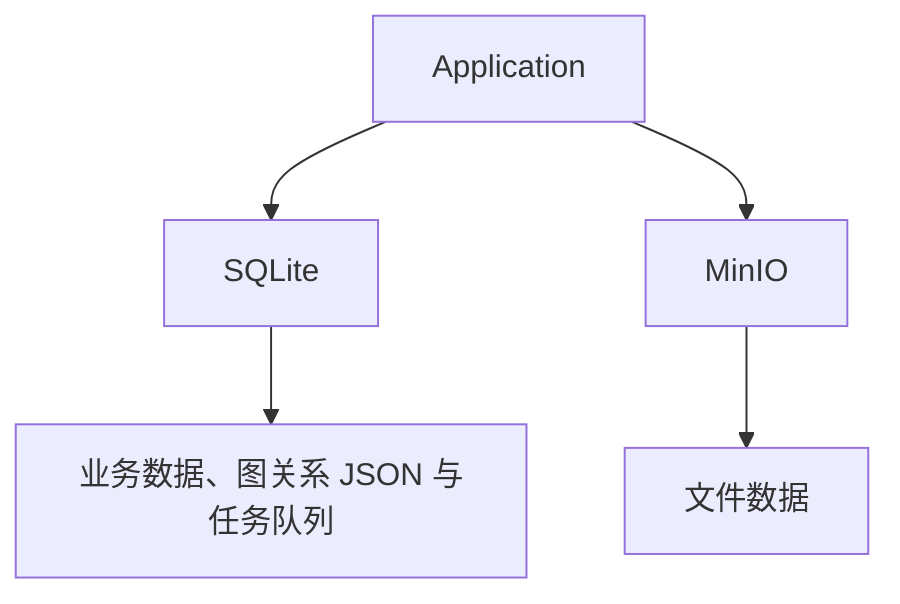
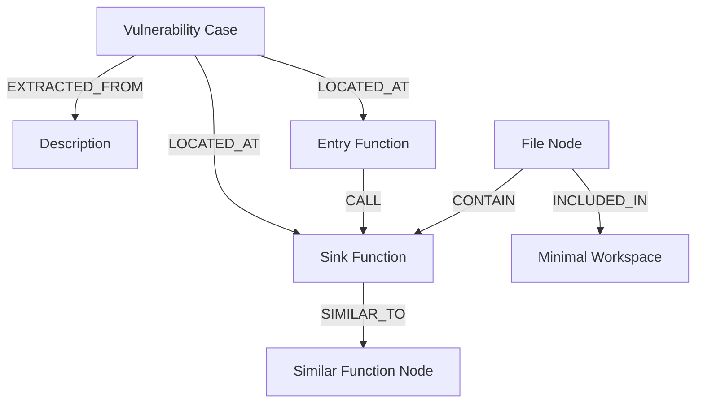
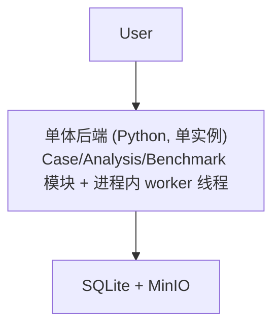
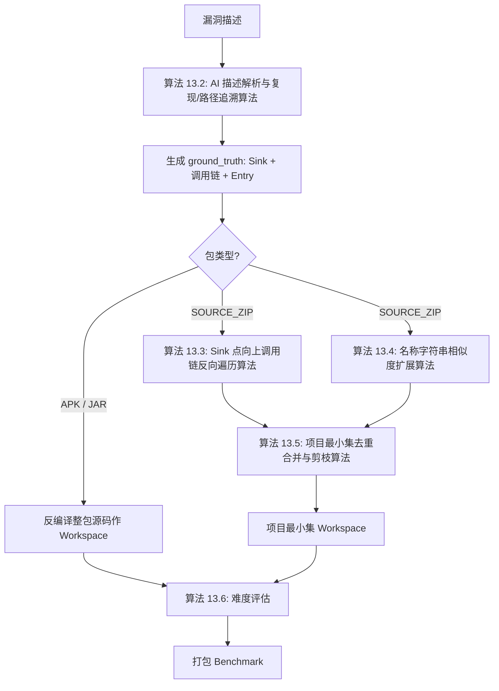

# V-Bench Builder 2.0 详细系统设计文档（V2.0 精简重构版）

| 项目 | 内容 |
| --- | --- |
| 文档名称 | V-Bench Builder 2.0 详细系统设计文档 |
| 版本 | V2.0 final |
| 日期 | 2026-07-27 |
| 状态 | 设计基线（精简重构版） |

## 文档定位

V-Bench Builder 2.0 是 **AI 漏洞挖掘能力评测数据集自动生成平台**。

**核心流程**：



> 系统职责止于**生成标准化 Benchmark**；Benchmark 的发布与分发不在本文档范围内。

**系统定位**：本系统**不是常规生产环境的漏洞扫描与检测平台**。不实现无目标的通用规则扫描，系统以漏洞中心已知漏洞通告/描述为驱动，通过 AI 引导复现与代码语义分析，生成高质量、最小上下文的 AI 评测数据集。

## 目录

1. [项目总体设计](#1-项目总体设计)
2. [系统总体架构](#2-系统总体架构)
3. [多语言分析架构](#3-多语言分析架构)
4. [漏洞定位设计](#4-漏洞定位设计)
5. [漏洞路径与代码清单扩展设计](#5-漏洞路径与代码清单扩展设计)
6. [Context Builder 与最小集构建设计](#6-context-builder-与最小集构建设计)
7. [Benchmark Generator 设计](#7-benchmark-generator-设计)
8. [Dataset QA 设计](#8-dataset-qa-设计)
9. [数据模型设计](#9-数据模型设计)
10. [API 接口设计](#10-api-接口设计)
11. [存储架构设计](#11-存储架构设计)
12. [部署架构与 MVP 实施计划](#12-部署架构与-mvp-实施计划)
13. [核心算法设计](#13-核心算法设计)
14. [可观测性设计](#14-可观测性设计)
15. [风险分析与技术挑战](#15-风险分析与技术挑战)
16. [附录](#16-附录)

---

## 1. 项目总体设计

### 1.1 项目背景

随着大语言模型（LLM）在软件安全领域的快速应用，AI 漏洞挖掘、AI 代码审计、AI 安全 Agent 逐渐成为新的研究方向。在实际生产中，漏洞已由 **AI 发现 + 人工审核** 确认，沉淀为漏洞中心的人工审核漏洞资产。

为持续提升 AI 发现漏洞的准确率，需要一套标准化的 **AI 漏洞挖掘能力评测库**，对 AI 的漏洞定位、路径理解与修复建议能力进行规模化、真实化评测。本系统即该评测库的自动化数据生产平台。

核心挑战在于：**如何基于漏洞中心已审核漏洞的自然语言描述 + 源码包，规模化、自动化地构建出上下文完整且无无关噪声的项目最小集 Benchmark？**

### 1.2 项目定位

V-Bench Builder 2.0 定位：**一个基于漏洞描述 AI 解析、漏洞引导复现、双维复杂度扩展与项目最小集剪枝的多语言 AI 漏洞 Benchmark 自动生成平台。**

* **输入**：漏洞中心原始描述文本 + 源码包（**源代码 zip / APK / JAR** 三种类型）
* **输出**：项目最小代码集 Workspace（源代码 zip 场景）或反编译还原的整包源码 Workspace（APK/JAR 场景，不裁剪）+ 标准化 AI 漏洞评测 Benchmark

### 1.3 核心流转逻辑

系统遵循极简且扎实 7 步流水线：

1. **漏洞中心漏洞 $\rightarrow$ 项目漏洞**：从漏洞中心批量获取数据，按受影响的代码仓库/项目进行归类。
2. **项目漏洞 $\rightarrow$ 单个漏洞描述**：拆解为独立漏洞实例，提取原始非结构化文本描述。
3. **AI 生成结构化数据（含漏洞复现与路径追溯）**：LLM 解析描述意图并**阅读源码反向推导调用链**，再经 **AI 语义复核**（判断路径是否真正可触发漏洞，不执行代码），精准捕获 **Sink 点**、**调用链起点（Entry，即追溯到的最上游已知业务函数，非框架入口）** 及 **完整调用链**——此为 ground truth 来源。
4. **按结构化数据生成代码清单**：映射到源码，生成包含漏洞关键代码的**基础种子代码清单（Seed List）**。
5. **清单扩展复杂度（双维扩展）**：
   * **维度 1（Sink 向上全调用链）**：基于 tree-sitter AST 构建的 Call Graph，从 Sink 向上反向遍历，将调用链上所有涉及的文件加入清单（不必到达入口层，链上节点即可）。
   * **维度 2（名称字符串相似度扩展）**：按函数名称字符串相似度（归一化编辑距离/SequenceMatcher）找与 Sink 同模式的函数，取 Top-N 所在文件作干扰项。
6. **清单合并成项目最小集**：将种子清单、调用链文件、相似度扩展文件合并去重与剪枝，构建出一个既包含完整漏洞逻辑又剔除绝大多数无关代码的 **项目最小代码集 Workspace**。
7. **生成标准化 Benchmark**：将项目最小集 Workspace 打包为标准化 Benchmark 数据集（含 task / ground_truth / metadata）。系统职责至此结束，发布与分发不在本文档范围。

> **APK/JAR 特例**：当输入为 APK 或 JAR（已打包的编译产物，自包含、不便裁剪）时，**跳过第 5、6 步的清单扩展与最小集剪枝**，但仍执行第 3 步的 AI 描述解析与复现追溯以获取 Sink 点与调用链作为 ground_truth；**反编译还原的整包源码**直接作为 workspace（不裁剪、行号指向反编译产物），进入第 7 步打包。

### 1.4 非目标范围

本系统明确不负责：

1. **常规生产环境无目标全盘扫描**：不执行通用的静态扫描或无通告驱动的常规 Taint 传播扫描。
2. **破坏性 Payload 攻击与 Exploit 挂载**：不复现/不触发漏洞；"复现验证"为 AI 语义复核（LLM 判断路径是否真正可触发），不执行任何代码、无沙箱。

### 1.5 总体设计原则

**原则 1：文本解析与复现双轮驱动**
以自然语言文本为切入点，通过 AI 复现/追溯在源码中定位精准的 Sink 点与调用链代码位置，将人工审核过的漏洞事实映射为可索引的代码级 Ground Truth。

**原则 2：双维扩展控制复杂度**
通过"Sink 向上调用链"保障业务逻辑的**深度**，通过"名称字符串相似度"引入合理的**广度**干扰，精准控制评测难度。

**原则 3：项目最小集收敛**
剔除无关文件，只保留漏洞相关与扩展干扰文件，实现 Token 消费与上下文理解的最佳平衡。

---

## 2. 系统总体架构

### 2.1 系统总体架构图



### 2.2 核心模块

1. **Vulnerability Case Service**：负责漏洞中心数据的抓取、按项目归类、单个案例生命周期管理。
2. **AI Description & Reproduction Engine**：负责自然语言解析、AI 阅读源码反向推导 Sink/Entry/完整调用链（ground truth）+ AI 语义复核可触发性。tree-sitter 不参与链路推导，仅用于下游复杂度扩展。
3. **Source Package Service**：负责源码包上传/校验/解压或反编译与项目识别；支持源代码 zip、APK、JAR 三种包类型（APK/JAR 为已打包编译产物，自包含，反编译还原源码后整包作 workspace、不裁剪）。
4. **Multi-Language Analyzer**：提供多语言 AST 解析与 Call Graph 构建（相似度扩展改用名称字符串相似度，非 Analyzer 能力）。
5. **Code Manifest & Expansion Engine**：负责生成基础代码清单，并执行"Sink 向上全调用链"与"代码相似度"的双维扩展。
6. **Minimal Workspace Builder**：对扩展后的清单进行并集合并、去重与剪枝，裁剪生成只包含核心逻辑的项目最小代码集。
7. **Benchmark Generator**：生成包含 `task.json`、`ground_truth.json`、`workspace/` 的标准数据集。
8. **Dataset QA**：自动校验 Schema、代码完整性、Ground Truth 准确度及可编译/运行状态。

---

## 3. 多语言分析架构

### 3.1 Language Adapter 统一设计

统一 Language Adapter Interface，将不同语言（Java / Python / Go / C/C++）的代码结构统一映射为 Unified Code Model：

```python
from typing import Protocol

class LanguageAdapter(Protocol):
    def parse_project(self, source_package_path: str) -> "UnifiedModel": ...
    def extract_ast(self, file_path: str) -> "ASTNode": ...
    def build_call_graph(self, source_package_path: str) -> "CallGraph": ...
```

> 代码相似度扩展改用名称字符串相似度（见 5.3 / 13.4），不在语言 Adapter 内实现，因此接口不再含相似度计算方法。

### 3.2 Unified Code Model 定义

```json
{
  "files": [{ "id": "F1", "path": "src/UserController.java" }],
  "functions": [{ "id": "FUNC1", "name": "saveUser", "file_id": "F1", "package": "com.example.service", "class_name": "UserService", "start_line": 100, "end_line": 150 }],
  "calls": [{ "caller_id": "FUNC1", "callee_id": "FUNC2" }]
}
```

*(四语言 Java/Python/Go/C++ 均由 tree-sitter 统一产出 AST 并抽取调用边构建 Call Graph，不引入框架入口/路由识别，也不依赖编译参数；C/C++ 在宏与头文件展开困难时可按需预处理)*

---

## 4. 漏洞定位设计

### 4.1 设计目标

基于 AI 描述解析得到的线索（`vulnerable_files` / `vulnerable_functions` / `trigger_mechanism`），结合复现追溯，在解压后的源码包中精确定位漏洞触发点（Sink 点）。算法实现见 13.2。

> **Sink vs Root Cause 区分（防误判）**：`sink` 必须是**危险操作的实际执行点**（如 `Runtime.exec` 拼接执行、SQL 拼接到 `executeQuery`、`parseXml` 未禁用实体的解析调用），而非漏洞**根因位置**（根因通常是"缺少校验/配置不当/未过滤"，发生在上游的另一文件）。本系统输入无 Patch（见 1.2），不依赖修复 Diff 推断 Sink；AI（13.2）在解析时须显式区分二者——根因记入 `trigger_mechanism` / `call_chain` 上游节点，Sink 仅锚定危险执行点，避免把"补丁修改处"或"缺失校验处"误判为 Sink 导致 ground truth 语义错乱。

### 4.2 定位输入与输出

**输入**：

- AI 描述解析得到的结构化线索：`vulnerable_files`、`vulnerable_functions`、`trigger_mechanism`、`cwe_type`。
- 解压后的源码包（`extracted_path`）及多语言 Adapter 输出的 Unified Code Model（File / Function / Call / Dependency）。
- tree-sitter 构建的 Call Graph（作为 AI 反向追溯的调用关系参考，非 ground-truth 链来源；ground-truth 由 13.2 的 AI 分析得出）。

**输出**：Vulnerability Location Node（文件、函数、行号），写回 `structured_data` 并作为后续 Graph 构建与 Context 选择的起点。

### 4.3 基于描述线索的符号映射

将漏洞描述中的自然语言线索映射为源码中的符号：

- **文件线索**：`vulnerable_files`（如 `UserController.java`）直接在 Unified Code Model 中按文件名/路径模糊匹配，得到候选 File 节点。
- **函数线索**：`vulnerable_functions`（如 `saveUser`）在候选文件内匹配 Function 节点；缺失时在该文件全部 Function 范围内搜索。
- **行为/触发线索**：`trigger_mechanism`（如"解析 XML 未禁用外部实体"）映射为敏感符号集合（如 `getHeader`、`parseXml`、`Runtime.exec`），作为 AST / Call Graph 检索的种子。

当文件或函数线索缺失时，直接进入 4.4 的引导式搜索，在全项目范围内基于触发线索定位候选。

### 4.4 AST / Call Graph 引导式搜索

当仅有行为线索、缺乏精确文件/函数时，采用引导式搜索：



步骤：

1. **AST 检索**：在全源码包内对敏感符号做 AST 级匹配，得到候选 Sink 函数集合。
2. **Call Graph 追踪**：以候选 Sink 为终点，沿 Call Graph 反向追踪调用链（不依赖框架入口识别，按调用关系逐层展开），形成完整调用路径。
3. **语义确认**：由 LLM 结合描述判断该路径是否满足所述漏洞触发条件（如"未禁用外部实体"对应代码中确实缺失 `setFeatureSecureProcessing` 等防护）。

> 本步骤产出的 Sink/调用链即 ground truth 来源，由 **AI（LLM 语义确认）** 锚定；tree-sitter Call Graph 仅作为反向追踪的调用关系参考，其近似性（接口分发/函数指针等）由 LLM 语义确认兜底，不影响 ground-truth 准确性。

### 4.5 Sink 点确认与存在性预检

成功标准是**从漏洞描述产出 Benchmark**——AI 推出的 Sink / Entry / Chain 能否直接进入下游最小集构建，只看一道**生产可行性前置**：

> AI 点名的 sink 文件与函数、`call_chain` 涉及的每个文件，必须在源码（zip 解压 / APK·JAR 反编译产物）中真实存在。

- **存在** → 采信，写回 `structured_data`（4.6），案例继续最小集构建与打包。
- **不存在** → 视为生产失败，状态置 `LOCALIZATION_FAILED`，转人工辅助定位（人工只确认代码级位置，不改漏洞事实）。

> **不设置信度阈值、不设 AI 语义复核硬性门禁**——二者都是 AI 内部信号，不能当质量门禁（LLM 自评过校准，自证循环）。AI 自评置信与语义复核结论仅记入 `structured_data` 供审计，不影响产出与否。漏洞本身已由漏洞中心人工审核为真，本系统只做代码级定位，ground truth 正确性由"漏洞为真"兜底。
>
> 存在性预检是第 8 章 QA Existence Check 的前移：AI 点名符号若不存在，下游最小集构建必然失败——提前 fail fast，省掉无谓的构建与打包开销。存在性只抓"AI 编造的不存在符号"这类幻觉，不保证 Sink 选得对；后者是接受范围内的风险，靠人工 fallback 在生产失败时兜。

### 4.6 定位结果写回 structured_data

最终确认的 Sink 点写回 `structured_data`：

```json
{
  "vulnerable_file": "XmlParser.java",
  "vulnerable_function": "parseXml",
  "sink_point": "XmlParser.java:42",
  "call_chain": ["UserController.saveUser", "UserService.processInput", "XmlParser.parseXml"],
  "entry_point": "UserController.saveUser",
  "method": "AI_TRACE"
}
```

该结果同时驱动第 5 章漏洞路径恢复与第 6 章 Context Builder 的扩展起点选择。

---

## 5. 漏洞路径与代码清单扩展设计

> 本章适用于**源代码 zip** 场景。APK/JAR 场景跳过代码清单扩展，反编译整包源码直接作为 workspace（详见 1.3 特例说明与第 6 章）。

### 5.1 基础代码清单生成 (Seed Manifest)

通过 AI 描述解析与漏洞复现，获取准确的 `Sink Function` 与调用链起点 `Entry Function`（复现追溯所得最上游已知函数，非框架入口）。第一步直接提取其所在文件：

$$S_{\text{seed}} = \{ \text{File}(F_{\text{sink}}), \text{File}(F_{\text{entry}}) \}$$

### 5.2 维度 1 扩展：Sink 向上全调用链反向追溯

Call Graph 由 **tree-sitter AST** 提取调用边构建（tree-sitter 解析出函数定义与调用点，连成"谁调用谁"的有向图）。从 Sink 函数出发沿 Call Graph 向上反向遍历，收集调用链上**所有上游 Caller**涉及的文件——**不必到达入口层**，链上出现的函数所在文件均纳入清单（以访问集去重 + 深度上限 `max_depth` 防止全项目扩散）：

> **职责边界**：此处 tree-sitter Call Graph **仅用于复杂度扩展**（召回上游相关文件），**非 ground-truth 调用链来源**——ground-truth 调用链由 13.2 的 AI 分析得出。tree-sitter 不做跨文件符号解算（接口分发/虚函数/函数指针等可能不精确），但对"文件召回"这一用途可接受；近似性只影响召回的文件集合，不影响 ground-truth。

$$\text{Chain}_{\text{upward}} = \{ f \mid f \in \text{Ancestors}(F_{\text{sink}}) \cup \{ F_{\text{sink}} \} \}$$

$$S_{\text{call}} = \{ \text{File}(f) \mid f \in \text{Chain}_{\text{upward}} \}$$

> 不依赖框架入口识别：不要求追到 Controller/Handler，调用链上任意上游节点所在文件都算有效扩展。

### 5.3 维度 2 扩展：名称字符串相似度扩展

在项目内按**名称字符串相似度**找与 Sink 同模式的代码作干扰项（不依赖 AST 哈希，直观可靠）。召回范围限定于 **Sink 的同 package（Java package / Go package / Python module）或同类**，以提升干扰项与漏洞逻辑的相关性，避免跨包同名函数造成无语义噪声。

1. **锚名**：取 Sink 函数名（及 `structured_data` 里的 `vulnerable_functions` / `vulnerable_files` 名称）作为锚。
2. **候选域**：仅取与 Sink 同包或同类内的函数作为候选（同包同名空间内更可能是同模式/同职责的关联代码）。
3. **相似度**：对候选域内每个函数，按名称字符串相似度（归一化编辑距离 / `SequenceMatcher.ratio`，0~1）与锚名比较。
4. **筛选**：排除已选集（$S_{\text{seed}} \cup S_{\text{call}}$）与 Sink 自身，设最低相似度门限 `min_sim`（默认 0.6，过滤短名/高频词如 `parse`/`exec` 的低区分度匹配），按文件聚合后取 Top-N（默认 3~5）文件纳入 $S_{\text{sim}}$。

> 例如 Sink 为 `parseXml`，可召回 `parseJson`、`parseYaml`、`XmlParser` 等名称相近的函数作干扰项。

---

## 6. Context Builder 与最小集构建设计

> 本章适用于**源代码 zip** 场景。APK/JAR 场景不进行最小集裁剪，整个包直接作为 workspace。

### 6.1 清单合并与去重

将三类文件清单求并集，得到候选代码清单：

$$S_{\text{candidate}} = S_{\text{seed}} \cup S_{\text{call}} \cup S_{\text{sim}}$$

### 6.2 最小集中裁剪与目录保全

最小集构建器（Minimal Workspace Builder）根据 $S_{\text{candidate}}$ 复制文件，同时**保留原始项目的相对目录层级结构**，自动剔除不相干的模块、图片、文档与编译产物。

```
minimal_workspace/
├── src/main/java/com/example/
│   ├── controller/UserController.java   (Entry & Upward Chain)
│   ├── service/UserService.java         (Upward Chain)
│   ├── util/XmlParser.java              (Sink Node)
│   └── util/JsonParser.java             (Similarity Expansion)
└── pom.xml                              (Project Metadata)
```

若 $S_{\text{candidate}}$ 超过 Token 限制（如 50,000 Tokens），优先保留 $S_{\text{seed}}$ 与 $S_{\text{call}}$，对 $S_{\text{sim}}$ 降序截断。

> 最小集剪枝产物物理落位 MinIO `workspace/{case_id}/`，路径由 `t_benchmark.workspace_path` 记录（见 11.5 / 9.1）。APK/JAR 场景不剪枝，反编译整包源码直接作为 workspace（见 6 章首注）。

---

## 7. Benchmark Generator 设计

### 7.1 交付物打包格式

生成的 `benchmark.zip` 包含标准四件套：

```
benchmark_VB001/
├── metadata.json       # 漏洞元数据 + 平台/语言/难度/文件清单（见 7.2）
├── task.json           # 给 AI Agent 的任务描述
├── ground_truth.json   # 准确的 Sink 点、调用链路径及修复方案（见 7.3）
└── workspace/          # 项目最小代码集（zip 场景）或反编译整包源码（APK/JAR 场景）
```

> 复现验证为 AI 语义复核（见 13.2），不产生可执行 PoC，故无 `poc.json`。
>
> Benchmark 产物物理落位 MinIO `benchmark/{id}/`，各子文件路径由 `t_benchmark` 表记录（见 11.5 / 9.1）；`workspace/` 在 zip 场景拷贝自 `workspace/{case_id}/`，APK/JAR 场景拷贝自 `source/{case_id}/decompiled/`。
>
> **workspace 打包脱敏（硬性）**：打包进 `workspace/` 前必须剔除一切敏感物——`.env` / 凭据 / token / 密钥 / `.git` / CI 配置 / agent 运行时配置（`opencode.jsonc` 等）；只保留源码与构建描述（`pom.xml`/`go.mod`/`requirements.txt` 等）。原 `source/{case_id}/original.*` 上传包、`.env`、MCP/config 一律不纳入 `benchmark.zip`，避免 live 凭据或运行时配置泄露。
>
> **与下游 agent 任务包对齐**：`metadata.json` 字段命名与下游验证 agent 任务包 `manifest.json`（`vuln_related_files` / `extra_evidence_files` / `source_package_paths` / `trace_files` / `platform`）保持一致，使 `benchmark.zip` 的 `workspace/` + `task.json` 可直接作为下游 agent（如 SecOcto/opencode `vuln-hunt-validate`）任务包的 `source/` + 任务输入；agent 运行时层（skills/env/config/MCP）不在本平台产出范围。

### 7.2 metadata.json 规范

```json
{
  "benchmark_id": "VB001",
  "case_id": "case-xxx",
  "cve_id": "CVE-2024-xxxx",
  "vulnerability_type": "CWE-79",
  "language": "Java",
  "platform": "web",
  "package_type": "SOURCE_ZIP",
  "difficulty": 72,
  "vuln_related_files": [
    "ruoyi-common/src/main/java/com/ruoyi/common/utils/file/FileUploadUtils.java",
    "ruoyi-admin/src/main/java/com/ruoyi/web/controller/system/SysProfileController.java"
  ],
  "extra_evidence_files": [],
  "source_package_paths": [],
  "trace_files": [],
  "created_at": "2026-07-29T00:00:00Z"
}
```

| 字段 | 说明 |
| --- | --- |
| `benchmark_id` / `case_id` | 交付物 ID 与源案例 ID |
| `cve_id` / `vulnerability_type` | CVE 编号与 CWE 类型 |
| `language` | Java / Python / Go / C++ |
| `platform` | 目标平台：`web` / `android` / `harmony-next` / `harmony-sa`（对齐下游 agent 按平台加载 scoring-criteria） |
| `package_type` | `SOURCE_ZIP` / `APK` / `JAR` |
| `difficulty` | 难度评分（见 13.6） |
| `vuln_related_files` | 最小集文件相对路径列表（Seed∪Call∪Sim 合并剪枝结果，与 `workspace/` 内容一致） |
| `extra_evidence_files` | 额外证据文件（配置/日志等），默认空 |
| `source_package_paths` | 原始包路径留位（脱敏后默认空，溯源由 `t_vulnerability_case` 承载） |
| `trace_files` | 复现轨迹文件，默认空 |
| `created_at` | 生成时间 |

> `vuln_related_files` 即最小集清单的对外暴露面，等价于原 BUILD_WORKSPACE 内存清单（不落库，见 9.1）固化后的产物；`platform` 用于下游 agent 选取对应 `scoring-criteria`。

### 7.3 ground_truth.json 规范

```json
{
  "vulnerability_type": "CWE-611",
  "sink_location": {
    "file": "src/main/java/com/example/util/XmlParser.java",
    "function": "parseXml",
    "line": 42
  },
  "entry_location": {
    "file": "src/main/java/com/example/controller/UserController.java",
    "function": "saveUser"
  },
  "call_chain": [
    "UserController.saveUser",
    "UserService.processInput",
    "XmlParser.parseXml"
  ]
}
```

> `sink_location` / `entry_location` / `call_chain` 均由 13.2 的 AI 分析源码得出（ground truth），`entry_location` 为业务逻辑调用链起点，非框架入口。`sink_location.line` 指向 workspace 实际源码行号——APK/JAR 场景即 AI 在反编译源码上分析所得行号（与 workspace 一致）；混淆场景下 AI 行号不可靠时降级为函数级（不写 line，见 8.4）。
>
> ground_truth 只含坐标答案（CWE + Sink + Entry + Chain + 行号）。`trigger_condition` / `sanitization_gap` 等深度评分要素**不纳入 ground_truth**——产出 Benchmark 用不到；将来若需深度评分，另立评分细则文件，不把答案泄露进答案本体。

---

## 8. Dataset QA 设计

自动校验 Pipeline 必须通过以下 4 项检查：

1. **Schema Check**：JSON 属性合法性校验；并核对 `workspace/` 不含敏感物（`.env` / 凭据 / token / 密钥 / `.git` / agent 运行时配置），违反即脱敏重打包（见 7.1）。
2. **Sink & Call Chain Existence Check**：校验 Ground Truth 中的文件、函数与行号是否在 `workspace/` 中 100% 存在且可索引。
3. **Workspace 可解析性 Check**：校验 `workspace/` 中代码可被 tree-sitter 逐文件解析（语法完整）。**不要求可编译**——workspace 供 AI 阅读理解而非编译运行，允许因最小集剪枝产生的缺失 `import` / 外部类型引用（悬空引用）存在；tree-sitter 按文件解析、不依赖符号解算，故此类悬空引用不影响解析通过。
4. **Line Integrity Check（混淆场景）**：当检测到 workspace 代码含大量无意义混淆符号（如 `a.b.c.a()`）时，AI 给出的行号可能不可靠，自动将 `ground_truth.json` 的 `sink_location.line` 置为 `null`，仅保留文件与函数名——避免错误行号在 AI Agent 评分时被当作命中扣分。

---

## 9. 数据模型设计

### 9.1 核心数据库表结构

> 类型按 SQLite 习惯标注（`TEXT` 为主，JSON 字段以 `JSON` 表示经 JSON1 扩展存取）。

#### 1. 漏洞案例表 (`t_vulnerability_case`)

| 字段 | 类型 | 说明 |
| --- | --- | --- |
| `id` | `TEXT` | 主键 ID |
| `project_name` | `TEXT` | 归类项目名称 |
| `cve_id` | `TEXT` | CVE 编号 |
| `raw_description` | `TEXT` | 原始非结构化漏洞描述 |
| `package_type` | `TEXT` | 源码包类型：`SOURCE_ZIP` / `APK` / `JAR` |
| `language` | `TEXT` | 开发语言：`Java` / `Python` / `Go` / `C++`（导入时从源码检测，写入 `metadata.json` 并进入 Benchmark `tags`） |
| `platform` | `TEXT` | 目标平台：`web` / `android` / `harmony-next` / `harmony-sa`（导入时录入，供下游 agent 选取 scoring-criteria，并写入 `metadata.json`） |
| `original_path` | `TEXT` | MinIO 原始上传包路径：`source/{case_id}/original.<ext>`（导入时写入；保留期 1 个月，到期清理由外部调度，路径随之失效） |
| `source_path` | `TEXT` | MinIO 解压/反编译后源码根路径：zip → `source/{case_id}/extracted/`；APK/JAR → `source/{case_id}/decompiled/`（中间过程件路径，Benchmark 打包后即清理，路径随之失效） |
| `structured_data` | `JSON` | AI 解析与复现得到的结构化数据 (Sink, Entry, Chain) |
| `status` | `TEXT` | 案例状态 |
| `created_at` | `TEXT` | 入库时间 |

> 原始包与解压/反编译源码的路径直接挂在案例行上（1:1，无独立生命周期，不单列 `t_source_package` 表）。两条路径均指向 MinIO 中间对象，按 11.7 保留期策略清理后失效，仅作生成期内的定位与溯源。

> **代码清单扩展不单列持久表**：三类文件清单（`seed_files` / `upward_chain_files` / `similar_files`）与 `final_minimal_set` 均为 BUILD_WORKSPACE 步骤的**一次性中间数据**，在 worker 进程内存中流转、产出 `workspace/` 目录后即丢弃，不落库；`final_minimal_set` 的物化结果由 `t_benchmark.workspace_path` 指向（见 11.5）。

#### 2. Benchmark 表 (`t_benchmark`)

> 记录每个 Benchmark 产物及其 **workspace（最小代码集 / 反编译整包源码）在 MinIO 的物理位置**。这是"最小代码集存哪里"的数据库记录。

| 字段 | 类型 | 说明 |
| --- | --- | --- |
| `id` | `TEXT` | 主键 ID（如 `VB001`） |
| `case_id` | `TEXT` | 关联案例 ID |
| `workspace_path` | `TEXT` | MinIO workspace 路径：zip 场景 → `workspace/{case_id}/`（最小集）；APK/JAR 场景 → `source/{case_id}/decompiled/`（整包源码，复用，不重复存储） |
| `metadata_path` | `TEXT` | `benchmark/{id}/metadata.json` |
| `task_path` | `TEXT` | `benchmark/{id}/task.json` |
| `ground_truth_path` | `TEXT` | `benchmark/{id}/ground_truth.json` |
| `package_path` | `TEXT` | `benchmark/{id}/benchmark.zip`（打包后整包，供下载） |
| `difficulty` | `INTEGER` | 难度评分（见 13.6） |
| `tags` | `JSON` | 漏洞集标签（多 facet），见 9.2 标签设计 |
| `qa_status` | `TEXT` | QA 状态：`PENDING` / `PASSED` / `FAILED` |
| `created_at` | `TEXT` | 生成时间 |

#### 2.1 标签设计（`t_benchmark.tags`）

每个 Benchmark（漏洞集）打一组 facet 标签，用于按维度列表/筛选漏洞集（"列出所有 Java 的 XSS 题"），无需从 MinIO 解 `metadata.json`：

```json
{
  "cwe": "CWE-79",
  "vuln_type": "Stored XSS",
  "language": "Java",
  "platform": "web",
  "package_type": "SOURCE_ZIP"
}
```

| facet | 取值来源 | 枚举 |
| --- | --- | --- |
| `cwe` | AI 推导（`structured_data`） | CWE 编号 |
| `vuln_type` | AI 推导 | 漏洞类型名（XSS / SQLi / XXE / RCE …） |
| `language` | 案例导入时源码检测 | `Java` / `Python` / `Go` / `C++` |
| `platform` | 案例导入录入 | `web` / `android` / `harmony-next` / `harmony-sa` |
| `package_type` | 案例导入录入 | `SOURCE_ZIP` / `APK` / `JAR` |

> 标签是 `metadata.json` 对应字段的**镜像/反范式**，专为查询而生——SQLite JSON1 可按 facet 过滤：
> ```sql
> SELECT id, difficulty FROM t_benchmark
> WHERE json_extract(tags,'$.language')='Java'
>   AND json_extract(tags,'$.cwe')='CWE-79';
> ```
> 标签字段与 `metadata.json` 同源，写入时一并落库，避免双写不一致。

#### 3. 任务表 (`t_task`)

| 字段 | 类型 | 说明 |
| --- | --- | --- |
| `id` | `TEXT` | 主键 ID |
| `case_id` | `TEXT` | 关联案例 ID |
| `task_type` | `TEXT` | `REPRODUCE` / `BUILD_WORKSPACE` / `QA` / `EXPORT` |
| `status` | `TEXT` | `PENDING` / `RUNNING` / `SUCCESS` / `FAILED` |
| `result` | `JSON` | 任务产物引用（指向 MinIO 路径或下游表 ID） |
| `created_at` | `TEXT` | 创建时间 |
| `updated_at` | `TEXT` | 状态更新时间 |

#### 4. QA 结果表 (`t_qa_result`)

| 字段 | 类型 | 说明 |
| --- | --- | --- |
| `id` | `TEXT` | 主键 ID |
| `benchmark_id` | `TEXT` | 关联 Benchmark ID |
| `check_name` | `TEXT` | `SCHEMA` / `EXISTENCE` / `PARSABLE` / `LINE_INTEGRITY`（见第 8 章） |
| `passed` | `INTEGER` | 0 / 1 |
| `detail` | `TEXT` | 失败原因（通过则为空） |
| `created_at` | `TEXT` | 校验时间 |

> 上述 4 张表与 11.3 所列核心表一一对应。代码文件本体存 MinIO，数据库只存**路径指针**与**结构化元数据**——避免在 SQLite 里塞大对象。
>
> `t_benchmark` 中**仅 `package_path`（`benchmark/{id}/benchmark.zip`）为长期有效指针**；`workspace_path` / `metadata_path` / `task_path` / `ground_truth_path` 指向的均为中间过程件，按 11.7 保留期策略清理后失效，仅作生成期内的临时定位。

---

## 10. API 接口设计

### 10.1 核心 API 流程

1. **提交漏洞描述与项目**：
   `POST /api/v1/cases` $\rightarrow$ 输入 `raw_description`、`source_package`、`package_type`（`SOURCE_ZIP` / `APK` / `JAR`）与 `platform`（`web` / `android` / `harmony-next` / `harmony-sa`）。
2. **触发 AI 结构化提取与漏洞复现**：
   `POST /api/v1/cases/{id}/reproduce` $\rightarrow$ 输出准确的 Sink 点与完整调用链（APK/JAR 场景需先反编译再追溯）。
3. **执行代码清单双维扩展与最小集构建**（仅 `SOURCE_ZIP`）：
   `POST /api/v1/cases/{id}/build-minimal-workspace` $\rightarrow$ 参数包含 `max_similar_files`, `max_tokens`；APK/JAR 跳过此步，反编译整包源码直接作为 workspace。
4. **打包与下载 Benchmark**：
   `GET /api/v1/benchmark/{id}/export` $\rightarrow$ 返回 `benchmark.zip`。
5. **按标签筛选漏洞集**：
   `GET /api/v1/benchmarks?language=Java&cwe=CWE-79&platform=web` $\rightarrow$ 按 `tags` facet 列出 Benchmark（返回 `id` / `tags` / `difficulty` / `qa_status`），支持 `language` / `cwe` / `vuln_type` / `platform` / `package_type` 任一组合过滤（见 9.2 标签设计）。

---

## 11. 存储架构设计

### 11.1 总体设计

V-Bench Builder 的数据具有明显不同类型：

| 数据类型 | 特点 |
| --- | --- |
| 业务数据 | 结构化 |
| 代码关系 | 图结构 |
| 源码文件 | 大文件 |
| 任务状态 | 高速访问 |

因此采用多存储架构。

### 11.2 存储总体架构



> 业务数据用 SQLite（单文件嵌后端进程，零运维）。
>
> 单实例部署下**不引入 Redis**：任务队列由 SQLite `t_task` 表承载（后端进程内 worker 线程轮询），缓存走进程内 LRU，锁走 `threading.Lock`——零独立中间件。

### 11.3 SQLite 设计

负责：Case 管理；Benchmark 管理；任务管理；**Vulnerability Graph 关系（以 JSON 字段承载，SQLite JSON1 扩展）**。核心表：`t_vulnerability_case`、`t_task`、`t_benchmark`、`t_qa_result`（共 4 张；源码包路径并入案例行、代码清单扩展为一次性中间数据，均不单列表，见 9.1）。

> SQLite 单文件库、嵌后端进程、零独立运维；**后端单副本写入**（多 Pod 共享同一 SQLite 文件不安全）；WAL 模式下读不阻塞、写串行，足够当前吞吐场景。

### 11.4 Vulnerability Graph 承载

Vulnerability Graph 不引入独立图库，由 SQLite 的 `t_vulnerability_case.structured_data` 以 JSON 字段承载（每案一份 Sink/Entry/调用链），用于连接"漏洞描述"、"复现生成的完整调用链"与"代码节点"。

- 节点：Vulnerability / File / Class / Function / Module / Description / Vulnerability Location。
- 关系：CALL、CONTAIN、DEPENDENCY、IMPORT、EXTRACTED_FROM、LOCATED_AT、SIMILAR_TO（相似度扩展，见 5.3/13.4）、INCLUDED_IN（文件归入最小集，见第 6 章）。



> 逐案生产，案间无跨语料图遍历需求，JSON 字段即可；若后续需跨案/全语料图查询（相似召回、共用 Sink 分析），再引入图库。

### 11.5 MinIO 对象存储

保存**代码文件本体与 Benchmark 产物**（数据库只存路径指针，见 9.1）。统一路径规约：

| 用途 | MinIO 路径 | 说明 |
| --- | --- | --- |
| 原始上传包 | `source/{case_id}/original.<ext>` | 用户上传的 zip / apk / jar 原包，留存溯源 |
| 解压后项目源码（zip 场景） | `source/{case_id}/extracted/` | 完整项目源码树，AI 分析与 tree-sitter 扩展的输入 |
| 反编译整包源码（APK/JAR 场景） | `source/{case_id}/decompiled/` | 反编译还原的整包源码，**即 APK/JAR 的 workspace 本体** |
| 最小代码集 workspace（仅 zip 场景） | `workspace/{case_id}/` | 剪枝后保留目录层级的最小集，**zip 场景的 workspace 本体** |
| Benchmark 产物 | `benchmark/{benchmark_id}/` | 含 `metadata.json` / `task.json` / `ground_truth.json` / `workspace/`（拷贝或软链自 `workspace/{case_id}/` 或 `source/{case_id}/decompiled/`） |
| Benchmark 整包 | `benchmark/{benchmark_id}/benchmark.zip` | 打包后供下载（见 7.1） |

> **APK/JAR 不重复存储 workspace**：反编译整包源码即 workspace，`t_benchmark.workspace_path` 直接指向 `source/{case_id}/decompiled/`，打包时将该目录作为 `workspace/` 纳入 `benchmark.zip`，不另存副本。zip 场景的最小集是独立剪枝产物，单独存于 `workspace/{case_id}/`。
>
> **最终仅 `benchmark/{id}/benchmark.zip` 长期保留**，其余 MinIO 对象（原始包、解压/反编译源码、独立 workspace 目录、未打包散文件）均为中间过程件，按 11.7 保留期策略清理由外部调度执行。

### 11.6 任务队列与缓存设计（进程内，无 Redis）

单实例部署下不引入 Redis，三类原 Redis 职责均下沉到进程内：

| 原 Redis 职责 | 单实例替代方案 | 说明 |
| --- | --- | --- |
| 任务队列 | SQLite `t_task` 表 + 后端进程内 worker 线程轮询 | `t_task` 表（见 9.1）即队列：写入 `PENDING` 行即入队，worker 取行改 `RUNNING`、完成后改 `SUCCESS`/`FAILED`；进程重启后 `PENDING`/`RUNNING` 行自动恢复重跑，不丢任务 |
| 状态缓存 | 进程内 LRU（`functools.lru_cache` 或进程内 dict） | 单实例下缓存天然一致，无需跨进程共享；常缓 AI 解析结果、tree-sitter 解析树等 |
| 分布式锁 | `threading.Lock`（或 `asyncio.Lock`） | 单进程内串行化即可，无跨副本竞争；按 `case_id` 维度加锁避免同案重复分析 |

> 不引入 Redis：队列、缓存、锁全部下沉进程内（见上表）。零独立中间件。

### 11.7 数据生命周期

流程：

```
漏洞导入 → 原始包入 MinIO (source/{case_id}/original)
→ 解压/反编译源码入 MinIO (source/{case_id}/extracted|decompiled)，路径挂入 t_vulnerability_case
→ AI 分析结果入 SQLite (t_vulnerability_case.structured_data)
→ (zip) 最小集剪枝入 MinIO (workspace/{case_id}/)，清单仅在内存流转不落库
→ Benchmark 打包入 MinIO (benchmark/{id}/benchmark.zip)，t_benchmark 记录路径与难度
→ 中间过程件（原始包 1 月内 + 解压/反编译源码 + 独立 workspace 目录 + 未打包散文件）按外部调度清理
→ 最终仅保留 benchmark.zip 长期归档
```

**保留期策略（清理分层）**：

最终长期保留的交付物**只有一个**：`benchmark/{id}/benchmark.zip`（zip 最小集 + metadata/task/ground_truth 三件 JSON 打包在内）。其余一切文件均为中间过程件，按下游产物生成时点清理。

| 层级 | 对象 | 清理时点 | 说明 |
| --- | --- | --- | --- |
| **原始输入** | `source/{case_id}/original.*`（用户上传的 zip / apk / jar 原包） | Benchmark 打包完成后起算，**保留期上限 1 个月** | 留作溯源，到期清理由外部调度执行 |
| **中间过程件** | `source/{case_id}/extracted/`（zip 解压源码）、`source/{case_id}/decompiled/`（APK/JAR 反编译整包） | 下游产物一生成立即清理 | 仅用于喂给 AI 分析与 tree-sitter 扩展 |
| **中间过程件** | `workspace/{case_id}/`（zip 最小集目录，未打包前） | 压入 `benchmark.zip` 后即清理 | 已固化进 zip，独立目录无保留价值 |
| **中间过程件** | `benchmark/{id}/` 下未打包的散文件（`metadata.json` / `task.json` / `ground_truth.json` / `workspace/`） | 压入 `benchmark.zip` 后即清理 | 同上 |
| **最终交付（不清理）** | `benchmark/{id}/benchmark.zip` | 长期保留 | 唯一长期保留物，含全部交付内容 |

- **zip 场景**：`extracted/` 在最小集剪枝落盘后可清；`workspace/{case_id}/` 在压入 zip 后可清。
- **APK/JAR 场景**：`decompiled/` 是 workspace 本体来源，**Benchmark 打包完成（`benchmark.zip` 已生成）后方可清理**；打包前不得删除。
- **执行归属**：清理由**外部专门调度**负责，本平台不执行删除、不维护清理任务；此处仅约定清理时点与保留期上限供外部调度参考。

---

---

## 12. 部署架构与 MVP 实施计划

### 12.1 部署目标与 MVP 目标

- **部署目标**：**单实例**部署（Container + Kubernetes，后端单副本）；**后端为单体服务（Python 实现）**，分析任务在后端进程内异步执行（**SQLite `t_task` 表作队列 + 进程内 worker 线程轮询，无 Celery、无 Redis**），**不单独部署 Worker 池、无沙箱**（复现验证为 AI 语义复核，不执行代码）。
- **MVP 目标**：建设完整闭环——漏洞输入 → 代码分析 → Benchmark 输出 → QA 验证。

### 12.2 总体部署架构



> 不拆分 Case/Analysis/Benchmark 三个微服务，合并为**一个 Python 单体后端，单副本**；不引入 API Gateway、不部署独立 Worker 池、无沙箱、**无 Redis**。源码解压/反编译/tree-sitter 解析/AI 追溯均在后端进程内以 worker 线程异步执行，任务队列落 SQLite `t_task` 表、缓存走进程内 LRU、锁走 `threading.Lock`。SQLite 单文件库嵌后端进程。

### 12.3 Kubernetes 组件与异步任务

- Namespace：`secflow-ns`
- Service：`secflow-api`（单体后端，**单副本**；ReplicaSet=1）
- 异步任务：分析（解压/反编译/tree-sitter 解析/AI 追溯/清单扩展）统一在后端进程内由 worker 线程异步执行（队列落 SQLite `t_task` 表）；无可信代码执行环节，故不设沙箱。

### 12.4 部署资源与可用性

- **单体后端（含异步任务，单实例）**：CPU 8 Core；Memory 16GB（大仓库解析/AI 追溯耗 CPU 与内存）。
- **存储层**：SQLite 单文件（挂 PVC，定期拷贝备份）；MinIO 纠删码。

### 12.5 MVP 范围与功能清单

支持语言：Java、Python、Go、C/C++。功能清单：

1. **AI 描述解析模块**：基于 LLM 的非结构化文本解析，提取漏洞线索（受影响组件/函数名/触发行为等），输出 `structured_data`，随后进入复现追溯定位代码级 Sink。
2. **漏洞引导式复现模块**：基于描述信息的代码定位与路径追溯 Agent，在源码中定位 Sink 点与漏洞调用路径（漏洞事实已人工审核，此处为代码级定位而非校验）。
3. **Case 管理**：支持输入文本描述；导入源码 zip；管理解析与复现状态。
4. **源码包获取**：支持 zip/APK/JAR 上传/校验/解压或反编译；项目结构识别；语言检测；APK/JAR 反编译整包源码直接作 workspace 不裁剪。
5. **多语言分析**：实现统一 Adapter（tree-sitter 统一解析，见 3.1）。能力：

| 语言 | tree-sitter 解析对象 |
| --- | --- |
| Java | Class / Method / Call |
| Python | Module / Function / Call |
| Go | Package / Function / Call |
| C/C++ | Function / Class / Call（宏/头文件展开困难时按需预处理） |

6. **漏洞定位（基于描述+复现）**：实现描述线索到符号映射；AST/Call Graph 引导式搜索；Sink 点确认与存在性预检。
7. **Vulnerability Graph**：实现节点（File、Function、Vulnerability Location）；关系（CALL、CONTAIN、DEPENDENCY）。
8. **Context Builder**：实现代码清单生成；sink 向上调用链扩展；代码相似度扩展；项目最小集合并。
9. **Benchmark Generator**：输出 `benchmark.zip`，包含 task.json、metadata.json（含难度，见 13.6）、ground_truth.json、workspace。
10. **Dataset QA**：实现自动检查：Schema；Ground Truth；定位一致性。

### 12.6 技术选型

- **后端**：Python（单体服务，单实例）。原因：与 LLM/分析生态契合；tree-sitter 有 Python 绑定；工程迭代快。
- **Parser**：统一 Tree-sitter（Python 绑定，覆盖 Java/Python/Go/C++），不引入 JavaParser/Clang 等语言专属解析器；C/C++ 宏与头文件展开困难时按需预处理。
- **Graph**：不引入图库，Vulnerability Graph 由 SQLite JSON 字段承载（见 11.4）。
- **Storage**：SQLite（单文件）+ MinIO（自建对象存储，非云 S3/OBS）。**不引入 Redis**。
- **Queue**：SQLite `t_task` 表 + 进程内 worker 线程（无 Celery/无 Redis）。
- **Cache/Lock**：进程内 LRU + `threading.Lock`。

---

## 13. 核心算法设计

### 13.1 算法总览



> 算法 13.3~13.5 仅对 `SOURCE_ZIP` 执行；APK/JAR 跳过清单扩展与剪枝，反编译整包源码直接作为 workspace。算法 13.6（难度评估）对两种场景均执行。

### 13.2 AI 描述解析与漏洞复现/路径追溯算法

> **职责边界**：本算法产出的 Sink / Entry / 完整调用链即 **ground truth 来源**，由 **AI（LLM）阅读源码反向推导**得出，**不依赖 tree-sitter Call Graph**（tree-sitter 仅用于 13.3 的复杂度扩展，近似即可）。**不执行代码、无沙箱**。成功标准是"从描述产出 Benchmark"——AI 推出的链通过**存在性预检**（见 4.5）即采信；AI 语义复核结论仅作审计记录，不作硬性门禁。

```python
def reproduce_and_extract_chain(raw_desc: str, repo_path: str):
    # Step 1: LLM 解析描述，提取关键词与 CWE 意图
    intent = llm_extract_intent(raw_desc)

    # Step 2: AI 静态语义追溯（LLM 阅读源码反向推导调用链）
    # Sink 须为危险操作执行点，与 Root Cause 区分（见 4.1）
    candidate_sinks = search_candidate_sinks(repo_path, intent.keywords)
    for sink in candidate_sinks:
        path = llm_backward_trace_to_entry(repo_path, sink, intent)  # LLM 读源码推导
        if not path:
            continue
        # 存在性预检：sink 文件/函数 + 调用链涉及文件必须在源码真实存在（见 4.5）
        if not existence_check(sink, path, repo_path):
            continue  # 幻觉符号，换下一个候选
        # AI 语义复核：路径是否真正可触发——仅作审计记录，不作硬性门禁
        audit = ai_verify_reproducibility(path, sink, intent)
        return {"sink": sink, "entry": path[0], "call_chain": path,
                "method": "AI_TRACE", "audit": audit}

    # 生产失败：AI 锚不出存在性通过的 Sink → 状态置 LOCALIZATION_FAILED，转人工辅助定位
    mark_localization_failed()
    return None
```

> `existence_check` 校验 AI 点名的 sink 文件/函数与 `call_chain` 涉及文件在源码中真实存在；`ai_verify_reproducibility` 为 LLM 语义复核（基于代码语义判断路径可达性与触发条件，**不运行任何代码**），结论写入 `audit` 供溯源，不影响产出与否。全程无沙箱、无 PoC 执行、无置信度阈值。

> `ai_verify_reproducibility` 为 LLM 语义复核（基于代码语义判断路径可达性与触发条件，**不运行任何代码**），与 `validate_path_semantics` 互补，强化"该链确实能触发漏洞"的置信。全程无沙箱、无 PoC 执行。

### 13.3 Sink 点向上调用链反向遍历算法

Call Graph 由 tree-sitter AST 提取调用边构建（**仅用于扩展召回，非 ground-truth 链；ground-truth 由 13.2 AI 分析得出**）。利用 BFS 从 Sink 沿 Call Graph 向上逆向遍历，收集调用链上所有上游 Caller 涉及的文件（不必到达入口层；以访问集去重 + 深度上限 `max_depth` 防止全项目扩散）：

```python
def trace_upward_call_chain(call_graph, sink_func, max_depth=5):
    visited_funcs = set()
    queue = [(sink_func, 0)]
    upward_files = []  # 有序列表（BFS 首见序 ≈ 由近及远），供 13.5 裁远端

    while queue:
        curr, depth = queue.pop(0)
        if curr in visited_funcs or depth > max_depth:
            continue
        visited_funcs.add(curr)
        if curr.file_path not in upward_files:
            upward_files.append(curr.file_path)

        # 获取调用当前函数的上层 Caller
        callers = call_graph.get_callers(curr)
        for caller in callers:
            queue.append((caller, depth + 1))

    return upward_files  # 近 → 远
```

### 13.4 基于名称字符串相似度的代码相似度扩展算法

**输入**：Sink 函数 $F_{\text{sink}}$；锚名集合 $A$（Sink 函数名 + `vulnerable_functions` / `vulnerable_files` 名称）；项目函数集合 $\mathcal{F}$；已选文件集 $S_{\text{seed}} \cup S_{\text{call}}$；N（默认 5）；最低相似度门限 `min_sim`（默认 0.6）。
**输出**：相似文件集 $S_{\text{sim}}$。

1. **同包/同类约束**：候选域限定为与 $F_{\text{sink}}$ 同 `package` 或同 `class_name` 的函数（见 Unified Model，3.2）。
2. 对候选域内每个函数 $f$，计算其名称与各锚名的字符串相似度，取最大值：$\text{Sim}(f) = \max_{a \in A}\text{StrSim}(\text{name}(f), a)$。
3. 排除已选集与 Sink 自身，按 $\text{Sim}$ 降序取 Top-N，所在文件纳入 $S_{\text{sim}}$。

```python
from difflib import SequenceMatcher

def str_sim(a, b):
    # 归一化字符串相似度，0~1
    return SequenceMatcher(None, a.lower(), b.lower()).ratio()

def expand_by_similarity(sink_func, all_funcs, selected_files, anchor_names,
                         n=5, min_sim=0.6):
    selected_files = selected_files or set()
    anchors = anchor_names or [sink_func.name]
    # 同包/同类约束：候选域限定与 Sink 同 package 或同类
    sink_scope = {sink_func.package, sink_func.class_name}

    # 1. 逐函数打分（取与各锚名的最大字符串相似度），按文件聚合
    file_best = {}  # file_path -> best score（召回单位为文件）
    for f in all_funcs:
        if f.file_path in selected_files or f.name == sink_func.name:
            continue
        # 仅召回同包/同类内的函数，避免跨包同名无语义噪声
        if f.package not in sink_scope and f.class_name not in sink_scope:
            continue
        sim = max(str_sim(f.name, a) for a in anchors)
        if sim >= min_sim:
            file_best[f.file_path] = max(file_best.get(f.file_path, 0), sim)

    # 2. 按文件分数降序取 Top-N 文件
    ranked = sorted(file_best.items(), key=lambda x: x[1], reverse=True)
    return [{"file_path": p, "score": s} for p, s in ranked[:n]]
```

> 仅名称字符串相似度（`SequenceMatcher.ratio`），无 AST 哈希、无 embedding、无向量库；直观可靠，可按需扩展到文件名/类名。通过 **同包/同类约束** + `min_sim` 门限（默认 0.6）双重过滤，避免跨包同名函数与短名/高频词（`parse`/`exec`）的低区分度匹配（见 5.3 / 13.4）；返回结构 `[{file_path, score}]` 供 13.5 按分数填充。

### 13.5 项目最小集合并与剪枝算法

> 仅 `SOURCE_ZIP` 执行；APK/JAR 跳过本算法。

```python
def build_minimal_workspace(seed_files, call_files, sim_files, token_limit):
    # call_files 为 13.3 输出，按 BFS 由近及远有序
    must_have_files = set(seed_files).union(call_files)

    # 二级裁减兜底：必选集本身超限时（巨型单文件 / 深链收集过多文件）
    if calculate_tokens(must_have_files) > token_limit:
        # (a) 优先保 Seed，调用链文件按"近 → 远"逐个装入，远端丢弃
        must_have_files = set(seed_files)
        for f in call_files:
            if calculate_tokens(must_have_files | {f}) <= token_limit:
                must_have_files.add(f)
            else:
                break
        # (b) 仍超限（Seed 自身过大）→ 降级为仅保留 Sink/Entry 函数骨架
        if calculate_tokens(must_have_files) > token_limit:
            must_have_files = trim_to_function_skeleton(seed_files, token_limit)

    current_tokens = calculate_tokens(must_have_files)

    selected_sim_files = []
    # sim_files 为 13.4 输出 [{file_path, score}]，按 score 降序填充至 Token 上限
    for item in sorted(sim_files, key=lambda x: x["score"], reverse=True):
        f_tokens = calculate_tokens({item["file_path"]})
        if current_tokens + f_tokens <= token_limit:
            selected_sim_files.append(item["file_path"])
            current_tokens += f_tokens
        else:
            break

    final_file_set = must_have_files.union(selected_sim_files)
    return copy_files_with_directory_structure(final_file_set)
```

> 边缘兜底：必选集 $S_{\text{seed}} \cup S_{\text{call}}$ 超 `token_limit` 时，先按 BFS 深度由近及远裁减远端调用链文件，仍超限则对超大 Seed 文件降级为仅保留 Sink/Entry 函数骨架（AST Signature），保证 workspace 不破 Token 预算。

### 13.6 Benchmark 难度评估算法

为 `metadata.json` 的"难度"字段提供量化来源。基于 workspace 规模、调用链深度与相似干扰项数量综合评分（20~100，越高越难），采用低系数线性求和并设上下界，避免中等规模案例封顶：

$$\text{Difficulty} = \min\!\left(100,\; \max\!\left(20,\; 5 \cdot \log_{10}(\text{Tokens}+1) + 4 \cdot \text{ChainDepth} + 3 \cdot \text{SimDistractions} + \text{Base}\right)\right)$$

- $\text{Tokens}$：workspace Token 数（规模维度），取 $\log_{10}$ 压平量级差异。
- $\text{ChainDepth}$：Sink 向上调用链层数（深度维度）。
- $\text{SimDistractions}$：相似度扩展引入的干扰文件数（广度维度）。
- $\text{Base}$：语言/编译复杂度基线（C/C++ 取 10，Java/Go 取 5，Python 取 3）。

> 示例：1 万 Token（$\log_{10}\approx4$）、链深 4、干扰 3、Java（Base 5）→ $5\times4+4\times4+3\times3+5=50$；10 万 Token、链深 8、干扰 5 → $5\times5+4\times8+3\times5+5=82$。APK/JAR 场景无裁剪与干扰项，$\text{SimDistractions}=0$、$\text{ChainDepth}$ 取复现所得调用链层数，难度主要由 $\text{Tokens}$ 与 $\text{Base}$ 决定。

> **方法论依据与局限**：本公式为**工程先验，无业界先例与理论背书**——业界安全评测集（Cybench / CyberSecEval / OWASP Benchmark / Big-Vul 等）均不用代码特征先验公式打分难度，主流是"类目标签 + 经验校准"两条路（见 16.1）。三维度（规模/深度/广度）+ 语言基线是常识性先验，权重 5/4/3 与 Base 10/5/3 为拍定值，作为**预估难度**输出。攒够 AI 作答数据后，可按通过率回归校准权重（业界做法），或改为经验校准档位（easy/medium/hard/extreme）。CWE 类目 + CVSS 严重度作为分类标签进 `tags`（见 9.2），与难度分离。

---

## 14. 可观测性设计

### 14.1 设计目标

保证系统：可监控；可定位问题；可分析性能。

### 14.2 可观测体系

两大部分：Metrics + Logging（**单实例不引入分布式追踪**）。

### 14.3 Metrics 设计

**系统指标**：CPU；Memory；Disk；Network。

**业务指标**：分析任务数量；Benchmark 生成数量；QA 成功率。

示例：

```
vbench_task_total
vbench_task_failed
vbench_benchmark_generated
```

### 14.4 Logging 设计

日志分类：

| 类别 | 记录内容 |
| --- | --- |
| API 日志 | 请求 |
| Worker 日志 | 分析过程 |
| Audit 日志 | 用户操作 |

### 14.5 告警设计

| 事件 | 级别 |
| --- | --- |
| Worker 失败 | 高 |
| 数据库异常 | 高 |
| 任务积压 | 中 |
| QA 失败率升高 | 中 |

---

## 15. 风险分析与技术挑战

### 15.1 生产失败与人工介入

漏洞本身已由漏洞中心人工审核为真，本系统只做代码级定位——故人工从不复核"漏洞对不对"，只在**流水线产不出 Benchmark** 时介入确认代码级位置。生产失败即人工介入，三类：

| 失败模式 | 触发 | 人工动作 |
| --- | --- | --- |
| **定位失败** | AI 锚不出 Sink/Chain（描述太模糊，候选 Sink 都不通过存在性预检） | 人工在源码上指认 Sink/Entry/Chain |
| **幻觉符号** | AI 点名的 sink 文件/函数或调用链文件在源码中不存在（4.5 存在性预检不过） | 人工指认真实代码点 |
| **QA 不可自愈** | workspace 构建失败或 QA 4 项不过且自动重打包无法修复 | 人工补文件或修 workspace |

> 人工只补"代码级定位"，不改漏洞事实；补完后案例回流水线继续自动跑（最小集构建 → 打包 → QA）。不存在"置信度阈值→人工"路径——AI 自评与语义复核都是内部信号，当不了质量门禁。

### 15.2 相似度文件噪音过多影响评测效果

* 引入过多相似文件导致上下文打散，评测结果偏离。

### 15.3 跨语言符号解析异构成本

* 不同语言的作用域/包管理/符号可见性机制差异巨大（C/C++ 头文件预处理、Go 同包隐式可见、Python 动态 Duck Typing），若为每语言写专属 AST Query 做跨文件依赖提取，工程维护成本指数级上升。

---

## 16. 附录

### 16.1 业界评测数据集的打分做法

本节调研业界安全/漏洞评测数据集如何量化"难度"，作为本平台难度设计（13.6）的外部参照。结论：**业界基本不用代码特征先验公式打分难度**，主流是"类目标签 + 经验校准"两条路。

| 数据集 | 怎么定难度 | 来源 |
| --- | --- | --- |
| **Cybench**（Stanford CRFM, arXiv 2408.08926） | CTF 比赛自带 easy/medium/hard 标签 + **人类解题耗时**做客观难度（最难题人类队 24h54m） | https://cybench.github.io/ |
| **CyberSecEval**（Meta PurpleLlama） | 按 **CWE 类目**分组，按"完成率"聚合；AutoPatchBench 按 patch 是否正确 | https://meta-llama.github.io/PurpleLlama/CyberSecEval/ |
| **OWASP Benchmark** | **无每题难度**；按 CWE 类目报工具的 precision / recall / TPR / FPR | https://owasp.org/www-benchmark/ |
| **Big-Vul / Devign / DiverseVul**（ML 漏洞检测数据集） | vuln/non-vuln 标签 + CVSS 严重度；**无难度** | — |
| **MMLU 类通用 LLM 评测** | **经验校准**：多数模型答错=难、答对=易，难度由通过率反推 | MMLU 范式 |

**归纳业界两条路**：

1. **类目标签 + 严重度**：CWE 类目、CVSS 严重度、CTF 难度档——分类/影响维度，非"找漏洞有多难"的连续分。
2. **经验校准**：跑 agent，按通过率反推难度——MMLU/Cybench 都走这条，**唯一被业界验证过的难度量化方式**。

> 对照本平台 13.6：现行 `f(Tokens, ChainDepth, SimDistractions, Base)` 公式**无业界先例、无理论背书**，属自创先验。

